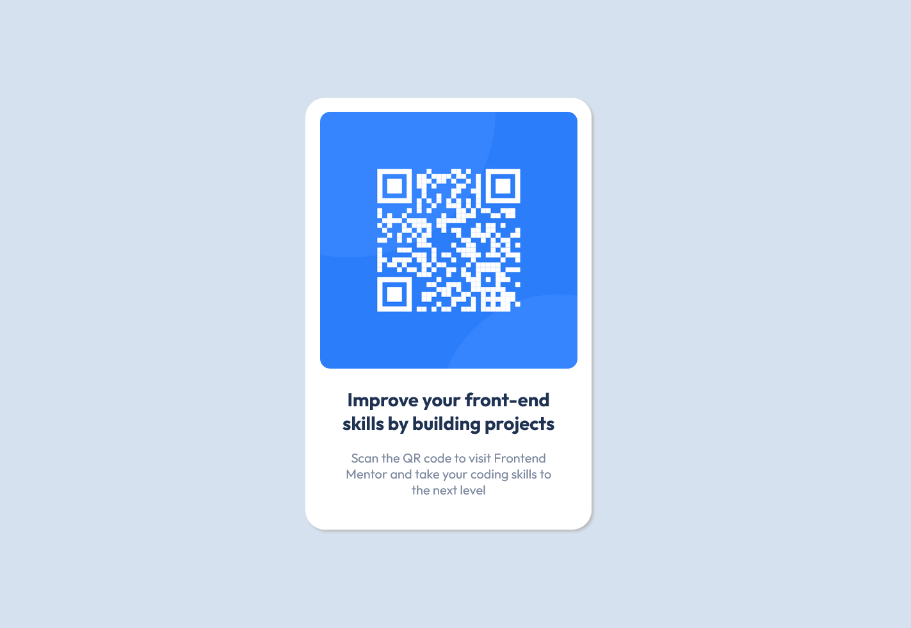

# Logan White - 7/6/23

# Frontend Mentor - QR code component solution

This is a solution to the [QR code component challenge on Frontend Mentor](https://www.frontendmentor.io/challenges/qr-code-component-iux_sIO_H). Frontend Mentor challenges help you improve your coding skills by building realistic projects.

### Screenshot

### Links

- Live Site URL: [Add live site URL here](https://your-live-site-url.com)

## My process

### What I learned

--CSS--

- Centering Elements with absolute position:

  - Set horizontal and vertical styles to 50%
  - Set margins for each equal to half the size of the element in that direction, in the negative direction

- Creating Breakpoints using @media queries and width ranges
  - Start designing for the smallest screen, around 320px wide, and design upwards
  - After initial CSS stylings, put media queries from smallest to largest screen sizes
  - @media (min-width: low end value) and (max-width: breakpoint) { }
